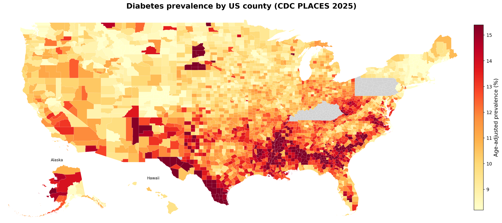
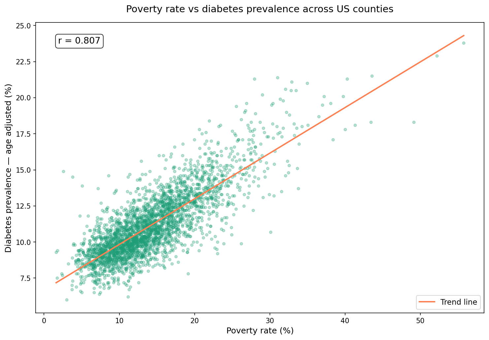

# Health Disparities and the Social Determinants of Chronic Disease

I built this project out of genuine curiosity about how much of chronic
disease burden comes down to where you live and the economic conditions
around you. Using CDC surveillance data, Census estimates, and USDA food
environment data I put together a pipeline covering every US county to
see what the data actually shows.

## What I Found

- Poverty rate and diabetes prevalence correlate at r = 0.807 across
  3,143 counties
- Once I controlled for other factors, physical inactivity came out as
  the strongest independent predictor (β = 0.287, p < 0.001)
- Seven social determinants together explain 84% of county-level diabetes
  variance (R² = 0.840)
- The geographic pattern shows the Southeast having a higher diabetes burden 
  on average while the Mountain West and Northeast tend to be lower
- Oglala Lakota County, SD has the highest diabetes prevalence in the
  dataset at 23.8% with a poverty rate of 55.8%
- Two coefficients were counterintuitive. Smoking came out negatively
  associated with diabetes — likely because smokers tend to have lower
  BMI and diabetes is strongly obesity-linked. Log income was positive
  once poverty was controlled, which is a suppressor variable effect.




---

## Data Sources

Three government datasets joined on FIPS county code:

| Source | Coverage | Variables |
|--------|----------|-----------|
| CDC PLACES 2025 | 3,143 counties | Chronic disease prevalence, health behaviors |
| Census ACS 2022 | 3,222 counties | Poverty, income, insurance, education, unemployment |
| USDA Food Environment Atlas 2025 | 3,156 counties | Food access, SNAP participation, food insecurity |

CDC PLACES suppresses estimates for 187 small counties where sample
sizes are too small to produce reliable estimates, thus these show as
missing on the maps.

---

## Regression Model

Three OLS models with increasing complexity:

| Model | Predictors | R² | AIC |
|-------|-----------|-----|-----|
| 1 — Poverty only | 1 | 0.652 | 10,276 |
| 2 — All social determinants | 7 | 0.840 | 7,981 |
| 3 — + State fixed effects | 7 + 49 | 0.942 | 5,059 |

### Model 2 Coefficients

| Predictor | Coefficient | p-value | Note |
|-----------|------------|---------|------|
| Physical inactivity | +0.287 | <0.001 | Strongest predictor |
| Unemployment rate | +0.154 | <0.001 | |
| Poverty rate | +0.151 | <0.001 | |
| Log income | +0.620 | <0.001 | Suppressor effect |
| Bachelor's degree rate | -0.013 | 0.012 | |
| Smoking rate | -0.053 | <0.001 | BMI confounding |
| Uninsured rate | -0.105 | 0.084 | Not significant |

All VIF values below 5 — no problematic multicollinearity.
Shapiro-Wilk test on residuals p = 0.223 — consistent with normality.

---

## Pipeline
CDC PLACES API → cdc_scraper.py    ─┐
Census ACS API → census_scraper.py  ├─→ SQLite DB → EDA → OLS Regression → Streamlit
USDA Excel    → usda_scraper.py    ─┘

---

## Project Structure
cdc-health-disparities/
├── data/
│   └── raw/                    ← excluded from Git — regenerate with scrapers
├── db/
│   ├── schema.sql              ← three-table normalized schema
│   ├── load_db.py              ← merges all three sources on FIPS code
│   └── cdc_health.db           ← SQLite database
├── scraper/
│   ├── cdc_scraper.py          ← CDC PLACES via Socrata API
│   ├── census_scraper.py       ← Census ACS via Census Bureau API
│   └── usda_scraper.py         ← USDA Food Atlas Excel download
├── notebooks/
│   ├── 01_eda.ipynb            ← choropleth maps, correlation analysis
│   └── 02_modeling.ipynb       ← OLS regression, diagnostics, coefficient plot
├── app/
│   └── streamlit_app.py        ← interactive dashboard
├── .env                        ← Census API key — never committed
└── requirements.txt

---

## How to Run

**1. Clone the repository**
```bash
git clone https://github.com/kennethho193/cdc-health-disparities.git
cd cdc-health-disparities
```

**2. Create and activate conda environment**
```bash
conda create -n cdc-health python=3.11
conda activate cdc-health
```

**3. Install dependencies**
```bash
pip install -r requirements.txt
```

**4. Add your Census API key**

Get a free key at [api.census.gov/data/key_signup.html](https://api.census.gov/data/key_signup.html)
then create a `.env` file in the project root:
CENSUS_API_KEY=your_key_here

**5. Run the data pipeline**
```bash
python scraper/cdc_scraper.py
python scraper/census_scraper.py
python scraper/usda_scraper.py
python db/load_db.py
```

**6. Launch the dashboard**
```bash
python -m streamlit run app/streamlit_app.py
```

---

## Limitations

- 187 counties missing from CDC PLACES due to small population suppression
- OLS does not account for spatial autocorrelation between neighboring
  counties
- The positive log income coefficient is a suppressor variable effect,
  not a real finding
- The negative smoking coefficient reflects BMI confounding rather than
  a protective effect
- Ecological fallacy — county-level associations do not necessarily
  hold at the individual level
- Temporal mismatch between CDC PLACES 2025 and Census ACS 2022 data

## Future Directions

- Spatial regression using pysal to account for geographic clustering
- Extend to additional outcomes — obesity, hypertension, depression, COPD
- Quantile regression to model the tails of the distribution
- Longitudinal analysis incorporating multiple years of CDC PLACES data
- Interactive maps using Folium or Plotly
- Random forest comparison to surface non-linear relationships

---

## Tools & Libraries

Python, SQL, pandas, numpy, statsmodels, geopandas, matplotlib,
seaborn, streamlit, requests, SQLite, Git

---

## Author

Kenneth Ho